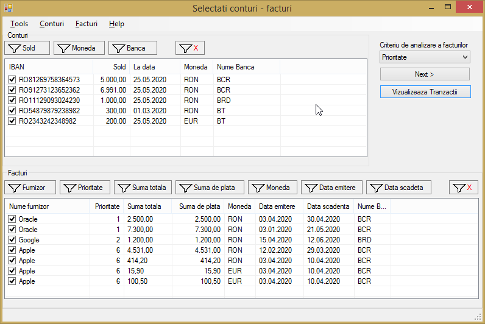

# Facturi
Aplicatia administreaza mai multe conturi la diferite banci si propune modalitati de plata a 
facturilor din aceste conturi exportand fisiere .csv de plata care pot fi importate in aplicatiile 
de banking ale fiecarei banci pentru a realiza tranzactiile.

### Download
You must have a SQL Server database created using the provided sql script!

<a href="https://github.com/ciucacosmin109/Facturi/raw/master/Facturi/bin/Release/Facturi.exe">Facturi.exe</a> 

<a href="https://github.com/ciucacosmin109/Facturi/raw/master/Facturi/bin/Release/Facturi.exe.config">Facturi.exe.config</a> 

<a href="https://github.com/ciucacosmin109/Facturi/raw/master/SqlQuery_1.sql">SqlQuery_1.sql</a> 

### Meniul principal
Meniul principal prezinta o lista de conturi disponibile, fiecare avand un sold disponibil 
la o anumita data (ultima data la care s-a actualizat soldul unui anumit cont), o moneda si numele bancii la 
care este inregistrat acel cont. Acesta mai contine si o lista de facturi, fiecare avand numele furnizorului, 
prioritatea acestuia, suma de pe factura, suma ramasa de plata, moneda, data emiterii si data scadenta.  

 
   

Filtre disponibile atat pentru conturi cat si pentru facturi:

 
   

### Alte formulare
Meniurile contextuale ofera posibilitarea de reimprospatare a datelor din baza de date ( Tools -> Refresh ) , 
de adaugare manuala a conturilor/ facturilor/ furnizorilor / etc..

 
   
    
   

### Scenarii
Dupa ce am selectat conturile dar si facturile pe care vrem sa le platim, va trebui sa selectam un 
criteriu referitor la ordinea de plata a facturilor. Optiunile disponibile sunt :
>-	Prioritate – prioritizeaza facturile de la furnizorii cu cea mai mare prioritate 
>-	Data scadenta - prioritizeaza facturile care au ce-a mai apropiata data scadenta 
>-	Valoare – prioritizeaza facturile cu valori mari in procesul de plata

Dupa ce vom apasa ‚Next’ programul va genera mai multe scenarii ( liste de tranzactii ) de plata a 
facturilor (daca este posibil). Aceasta actiune ne va duce intr-un nou formular unde ne sunt prezentate 
toate posibilitatile de plata tinand cont de criteriul ales mai sus.

 
   

Acest formular prezinta in ai multe tab-uri scenariile posibile de plata ordonate crescător după costul operațiunilor. 
Odată ajunși aici putem continua prin apăsarea butonului ‚Salvare’ care va salva tranzacțiile in baza de date, 
cu posibilitatea de a le exporta mai târziu pentru a le plăti.
Daca nu vrem sa plătim una din facturi integral sau dorim sa plătim mai mult in alta factura sau pur si simplu sa plătim 
parțial si alta factura care nu a putut fi plătita integral, putem merge pe butonul de ‚Editare ->’ pentru a edita scenariul 
curent într-o forma tabelara mai ușor de înțeles. 

### Editarea unui scenariu
Putem observa ca a 2a factura de la Oracle nu a putut fi plătita din niciun cont deoarece nu avem bani suficienți. 
Acum putem edita acest scenariu plătind 900 RON pentru acea factura.
Selectam contul din care vrem sa se facă plata apăsând dublu-click la intersecția facturii cu acel cont. 
Aceiași procedura o vom urma daca dorim sa schimbam contul din care o factura se plătește la momentul actual. 
Daca dorim sa nu mai plătim o factura facem dublu-click pe locul selectat anterior si suma va dispărea.

Acum ca am selectat contul, se va pune valoarea 0,00 RON in dreptul facturii iar la intersecție 
va fi costul fix aferent acestei plăti. Valoarea care este pusa inițial, fiind 0, valoarea de la 
intersecție va fi chiar costul fix aferent tranzacției din acel cont. Acum vom modifica valoarea pe 
care vrem sa o plătim furnizorului:
 
După ce am selectat valoarea de plata pentru factura, valoarea totala de plata s-a actualizat si ea 
la 991 RON, costul tranzacției fiind de 91 de RON. 

 
   

Dupa ce am decis ce modificari sa facem putem trece mai departe apasand salvare iar scenariul 
va fi modificat in formularul precedent

### Exportul de tranzactii
Rolul acestui formular este de a exporta tranzactiile facute pentru a fi platite.

 
   

Fiecare banca poate avea cate un template de fisier .csv personalizabil.

 
   

## License
[GPL v3](./LICENSE)
